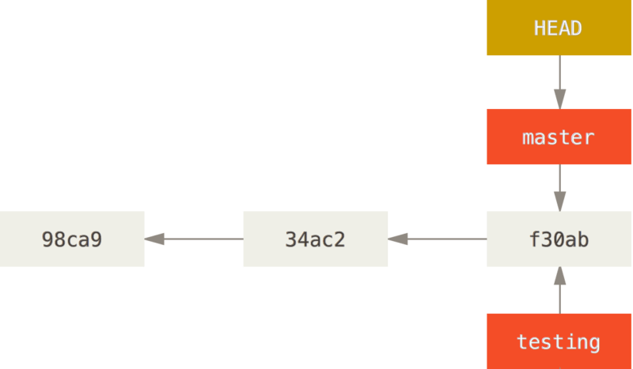

# Git - 存储和分支

公司里很多小伙伴用 git 非常别扭，似乎只有 -f 才能拯救世界。秉承“操作 git 的失误就要用 git 的正常命令层层回退”的原则，这里整理一下 git 存储和分支的“原理”，帮助理解 git 所提供的丰富的命令。

## 参考

[Git 分支 - 分支简介](https://git-scm.com/book/zh/v2/Git-%E5%88%86%E6%94%AF-%E5%88%86%E6%94%AF%E7%AE%80%E4%BB%8B)

## 存储

首先要明确，Git 保存的不是文件的变化或者差异，而是一系列不同时刻的文件快照。

在暂存文件时（`git add`），Git 会计算这些文件的校验和，然后把这些文件的快照以 blob 对象的形式保存到 Git 仓库中。

在提交时（`git commit`），Git 会计算每一个子目录的校验和，然后把目录和文件的校验和组织成一个树对象。之后，创建一个提交对象，这个对象里存储着：

- 指向文件树对象的指针
- 作者姓名和邮箱
- 这次提交的父对象（可能有零个、一个或多个）

假设一开始我们的工作区里只有三个文件，那么执行 `add` 和 `commit` 后会生成如下结构：

如果我们多次修改、提交，那么后一次的提交对象就会包含上一次提交的指针（作为父对象）：

## 分支

Git 的分支，其实本质上仅仅是指向提交对象的可变指针。 每次的提交操作中，当前分支的执政都会自动向前移动。

所以很容易理解，创建分支（`git branch`）其实就是新建了一个指针，指向当前提交记录。

那么 Git 是如何知道当前在哪个分支上的呢？也很简单，Git 有一个名为 `HEAD` 的特殊指针，它指向谁，就代表当前在哪个分支上。分支的切换（`git checkout`）就是在移动 `HEAD` 的指向。

## “三棵树”

在初步理解指针的移动之后，一个新的问题出现了，Git 是如何修改磁盘上实际的文件的？比如 `checkout` 和 `reset`？

为了解释这一过程，Git 提出了三棵树的模型，注意表格中的“用途”一栏只做帮助理解只用：

| 树 | 用途 | 实质 |
| -- | ---- | --- |
| HEAD | 上一次提交的快照，下一次提交的父结点 | 指向当前分支、即上一次 commit 的指针 |
| Index | 预期的下一次提交的快照 | “暂存区”，数据结构上只是一个列表而非树 |
| Working Directory (WD) | 沙盒 | 其他两棵在 `.git` 文件夹中的树的解包，即你直接能编辑文字的工作目录。|

一般而言，文件在三棵树的切换方式如下：

我们可以这样理解：

- 我们只能直接编辑 WD 中文件的内容。
- `git add` 即把文件从 WD 复制到 Index 列表里。
- `git commit` 即生成 Index 列表里文件的快照，保存到 Commit 对象里。
- `git checkout` 即执行如下流程：
  - 移动 HEAD 指向你所指定的分支
  - 将这次提交的快照填充到 Index 中
  - 将 Index 中的内容复制到 WD
- `git reset` 即执行如下流程：
  - 移动 HEAD 指向你所指定的分支（若指定了 --soft，则到此停止）
  - 使 Index 看起来像 HEAD（若未指定 --hard，则到此停止）
  - 使 WD 看起来像 Index

总之，对于以上命令的操作，若只考虑操作 commit，那么仅有 `git reset --hard` 可能会对 WD 造成*不可挽回*的修改，其他操作我们都可以用 git 命令做修正。

记住，不要惊慌，遇事不决 `git reflog` :joy: